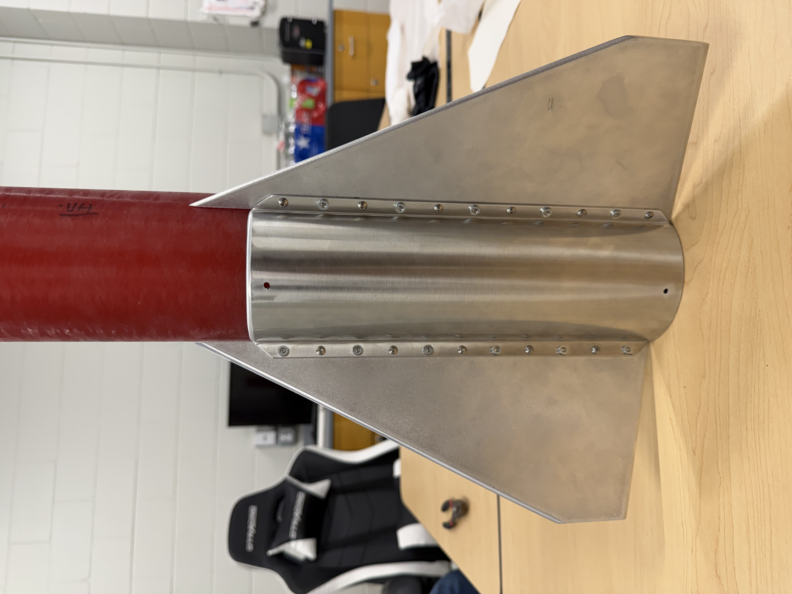
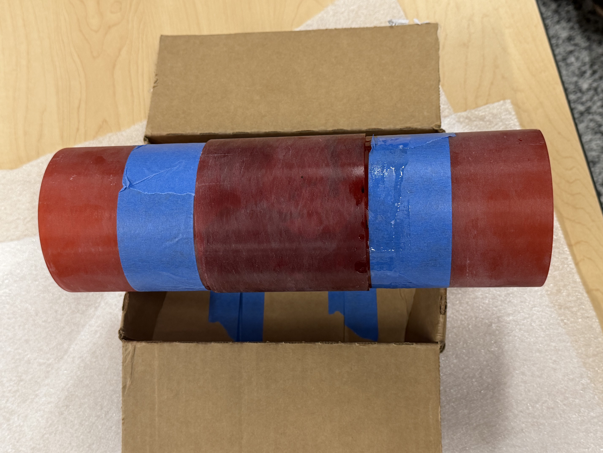
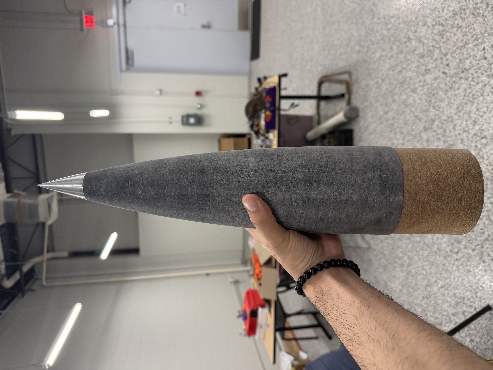
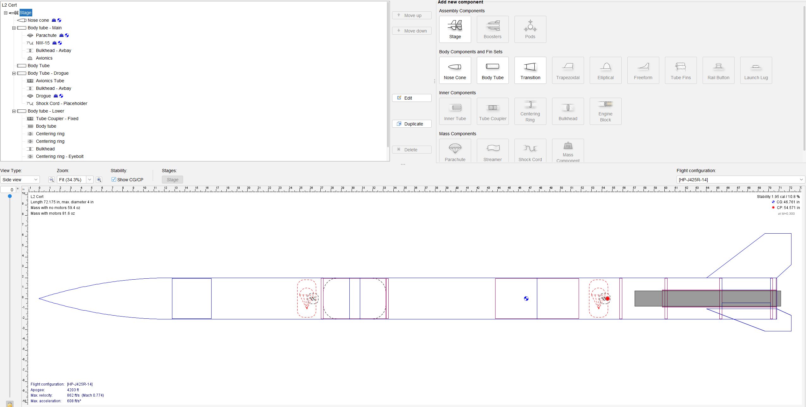
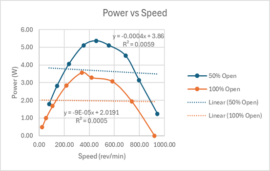
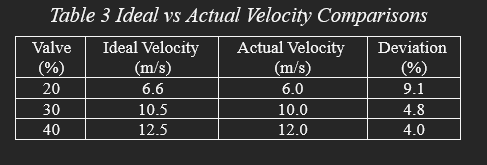
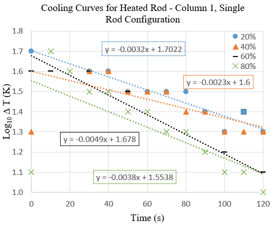
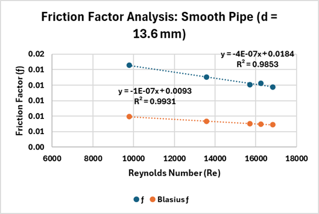

# Marcos Esparza – Engineering Portfolio  
Mechanical Engineering Student | Energy Systems | Thermo-Fluids | Experimental Testing | Applied Design

[About](#about-me) • [Resume](#resume) • [Featured Project](#featured-project--irec-2026) • [Projects](#selected-engineering-projects) • [Skills](#skills) • [Contact](#contact)

---

## About Me

I am a Mechanical Engineering student at the University of Texas Permian Basin, graduating in December 2026, with a technical focus on energy systems, thermo-fluids, experimental testing, and mechanical design. My work is centered on connecting engineering analysis to real hardware, measured data, and practical system performance.

I currently serve as Aerodynamic Design Lead for the Falcon Aeronautics & Space Team, where I am leading fin-can and aerodynamic development for a 10,000-ft competition rocket for the Spaceport America Cup and Lone Star Cup. My responsibilities include stability and flutter analysis, CAD integration, and making sure the design is manufacturable, flight-ready, and well documented.

My laboratory and project experience includes cross-flow heat exchangers, fluid friction and bend losses, flow-measurement devices, transient cooling, turbomachinery performance, and rocket flight design. Across these projects, I have developed experience in pressure-drop analysis, heat transfer, data reduction, test interpretation, and engineering decision-making.

I am especially interested in engineering roles where analysis, testing, and hardware come together, particularly in energy, production, and fluid-based systems.

---

## Resume

- **[📄 View Resume (PDF)](assets/img/MarcosEsparza_Resume.pdf)**
- **[🔗 LinkedIn](https://www.linkedin.com/in/marcos-v-esparza/)**
- **[🔗 Falcon Aeronautics & Space Team GitHub](https://github.com/MarcosEsparza/Falcon-Aeronautics-and-Space-Team)**

---

## Featured Project — IREC 2026

**Role:** Aerodynamic Design Lead  
**Team:** Falcon Aeronautics & Space Team, UTPB  
**Tools:** SOLIDWORKS, MATLAB, OpenRocket, Excel

### Project Summary

Leading aerodynamic and fin-can development for a 10,000-ft collegiate competition rocket designed for the Intercollegiate Rocket Engineering Competition (IREC). The project is being developed around real flight constraints: stable transonic performance, manufacturable hardware, clean subsystem integration, reliable recovery packaging, and sufficient flutter margin at expected peak velocity.

### Engineering Scope

- Designed fin geometry and evaluated aerodynamic stability using MATLAB and OpenRocket.
- Developed a modular **4.02 in fiberglass airframe and aluminum fin-can architecture** in SOLIDWORKS.
- Performed preliminary fin flutter analysis with a target of **at least 1.5× maximum flight velocity margin**.
- Integrated recovery, internal structure, and avionics packaging into a unified CAD workflow.
- Supported technical documentation and design traceability through organized simulation, CAD, and GitHub records.

### Current Flight Simulation — L1500T

- **Apogee:** 10,990 ft  
- **Maximum velocity:** 1,191 ft/s (Mach 1.077)  
- **Maximum acceleration:** 431 ft/s²  
- **Static stability margin:** 2.76 cal  

### Aluminum Fin Can Design

**Material:** 6061-T6 aluminum  
**Configuration:** Modular fin-can integrated with 4 in fiberglass airframe  
**Design goal:** Structural robustness and flutter margin suitable for transonic flight

Planform view:  

Side view:  

Isometric view:  

**Related MATLAB Code:** [Fin Flutter Solver](https://github.com/MarcosEsparza/Falcon-Aeronautics-and-Space-Team/blob/main/simulations/matlab/fin_flutter/AluminumFinCan.m)

### Hardware Build Progress

The IREC vehicle has progressed from simulation and CAD into physical hardware fabrication and subsystem integration. These images show actual progress on the rocket’s fin can, airframe assembly, and nose cone hardware.

**Fabricated fin can assembly**

  

*Figure: Fabricated aluminum fin can installed on the fiberglass airframe, showing the real fin-body interface and assembled hardware.*

**Airframe integration and assembly**

  

*Figure: Bonded airframe section during fabrication, documenting structural integration and physical build progress.*

**Nose cone hardware**

  

*Figure: Fiberglass nose cone with metallic tip and lower shoulder, representing a completed upper vehicle hardware component.*

---

## Selected Engineering Projects

### Level 1 High-Power Rocket Certification

**Role:** Designer and Builder  
**Tools:** OpenRocket, hand calculations, fabrication and launch prep  
**Launch Site:** San Angelo, TX  

- Designed, built, and successfully flew a Level 1 certification rocket.
- Reached **2,148 ft**, with approximately **2.4% error** relative to predicted altitude.
- Demonstrated strong agreement between simulation and actual flight performance.
- Motor used: **H219T-14**

<video width="480" controls>
  <source src="assets/img/IMG_4424.mp4" type="video/mp4">
  Your browser does not support the video tag.
</video>

---

### Level 2 Certification Rocket — In Progress

**Role:** Designer and Builder  
**Tools:** OpenRocket, CAD, avionics integration, recovery system planning

- Designing a **4 in dual-deploy Level 2 rocket** with dedicated drogue and main recovery bays.
- Current simulated apogee is approximately **4,200 ft** on a **J425R-14** motor.
- Current design work emphasizes structural reliability, recovery sequencing, avionics integration, and repeatable field operations.
- Current target stability margin is approximately **1.9 cal**.

---

## Featured Lab Reports

A selection of projects most relevant to thermo-fluids, energy systems, and experimental analysis.

### Performance Analysis of a Turbojet Engine (SR-30 Mini-Lab)

**Role:** Lab Team Member  
**Tools:** SR-30 Mini-Lab, LabVIEW, DAQ, Excel, MATLAB

- Evaluated compressor-inlet and nozzle-exit flow conditions for an SR-30 turbojet.
- Estimated density, velocity, Mach number, and mass flow rate across the engine.
- Developed a one-dimensional momentum-based thrust model and compared prediction to measured thrust.
- Interpreted discrepancies in terms of non-ideal flow behavior and instrumentation limitations.

**Report:** [PDF](assets/img/Performance%20Analysis%20of%20a%20Turbojet%20Engine.pdf)

  

---

### Pelton Turbine – Performance and Efficiency

**Role:** Lab Team Member  
**Tools:** Pelton turbine rig, load cell, tachometer, Excel

- Measured turbine behavior under varying spear-valve positions and loading conditions.
- Generated torque-speed and power-speed relationships.
- Calculated hydraulic power and overall efficiency.
- Connected experimental behavior to turbomachinery performance fundamentals.

**Report:** [PDF](assets/img/Lab2%20Pelton%20Turbine.pdf)

  

---

### Cross-Flow Heat Exchanger – TE93

**Role:** Lab Team Member  
**Tools:** TE93 rig, pitot-static measurements, DAQ, Excel

- Measured velocity and pressure behavior across a cross-flow rod bank.
- Compared experimental behavior against theoretical trends and heat-transfer correlations.
- Applied thermo-fluids analysis to interpret convective behavior and flow losses.

**Report:** [PDF](assets/img/Lab6%20Cross%20Flow%20Heat%20Exchanger%20(1).pdf)

  

---

### Cooling Rate and Transient Convection

**Role:** Lab Team Member  
**Tools:** TE93 apparatus, thermocouples, DAQ, Excel

- Measured transient cooling of a heated copper rod under varying airflow conditions.
- Applied lumped-capacitance analysis to estimate convective heat-transfer coefficients.
- Compared experimental results to expected correlation-based values.

**Report:** [PDF](assets/img/Lab7%20Cooling%20Rate.pdf)

  

---

### Fluid Friction and Bend Loss – H408

**Role:** Lab Team Member  
**Tools:** H408 apparatus, pressure gauges, Excel

- Measured friction factors in smooth and rough pipes and across multiple fittings.
- Calculated Reynolds number, head loss, and minor loss coefficients.
- Compared results against standard correlations including Moody and Blasius trends.
- Related findings to piping systems, pump performance, and industrial fluid transport.

**Report:** [PDF](assets/img/Lab3%20Friction%20Fluid.pdf)

  

---

## Supporting Experimental Work

- **Flow Measuring Devices**  
  Compared orifice plates, Venturi meters, and rotameters; evaluated discharge coefficients and uncertainty.  
  **Report:** [PDF](assets/img/Lab5%20Flow%20Measuring%20Devices.pdf)

- **Bend Loss in Pipe Fittings**  
  Measured minor losses across fittings and compared experimental coefficients with handbook values.  
  **Report:** [PDF](assets/img/Lab%204%20Bend%20Loss.pdf)

- **Velocity Profile in Cross-Flow**  
  Mapped wake behavior and downstream velocity variation using pitot-based measurements.  
  **Report:** [PDF](assets/img/Lab8-Velocity%20Profile.pdf)

- **Impact of a Jet**  
  Investigated momentum transfer and compared measured reaction forces with theory.  
  **Report:** [PDF](assets/img/Lab1%20Impact%20of%20a%20Jet-1.pdf)

- **Impact: Charpy and Izod**  
  Compared absorbed energy and fracture behavior for multiple 3D-printed polymers.  
  **Report:** [PDF](assets/img/Lab9-Impact%20Charpy%20and%20Izod.pdf)

- **Torsion Test**  
  Evaluated torque-angle response, shear modulus, and elastic-plastic shaft behavior.  
  **Report:** [PDF](assets/img/lab10-%20Torsion%20Lab%20Report.pdf)

---

## Skills

### Engineering Software
- SOLIDWORKS
- MATLAB
- OpenRocket
- Excel
- LabVIEW / DAQ systems

### Analysis and Testing
- Experimental data reduction
- Pressure-drop and head-loss analysis
- Heat-transfer analysis
- Turbomachinery performance calculations
- Flow measurement and instrumentation
- Engineering plotting and technical reporting

### Design and Domain Areas
- Thermo-fluids and energy systems
- Rocket aerodynamic design
- Stability and flutter analysis
- Recovery system integration
- Mechanical design for manufacturable hardware

### Certifications
- National Association of Rocketry (NAR) Level 1 High-Power Certification
- Level 2 High-Power Certification in progress

---

## Organizations

- ASME – Student Member
- AIAA – Student Member
- National Association of Rocketry – Student Member
- Tripoli Rocketry Association – Student Member

---

## Contact

- **Email:** esparza_m58311@utpb.edu  
- **LinkedIn:** [linkedin.com/in/marcos-v-esparza](https://www.linkedin.com/in/marcos-v-esparza/)

[Back to Top](#marcos-esparza--engineering-portfolio)
