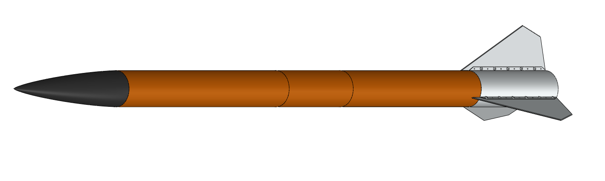
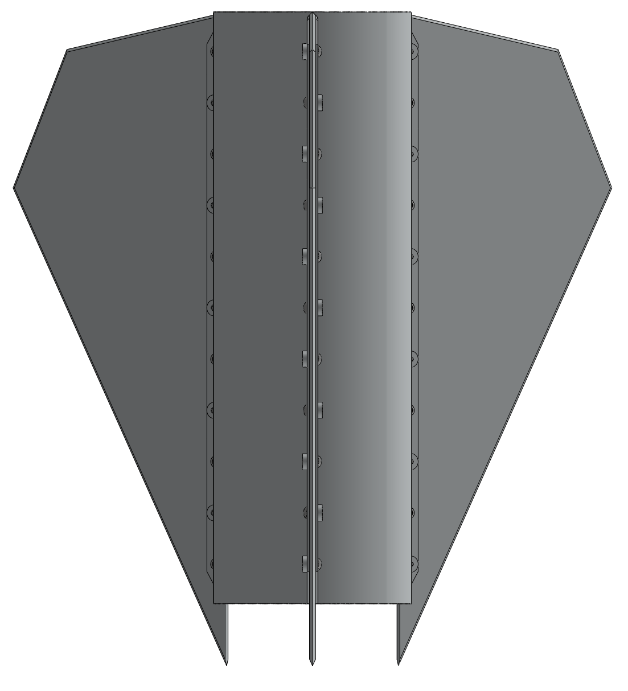
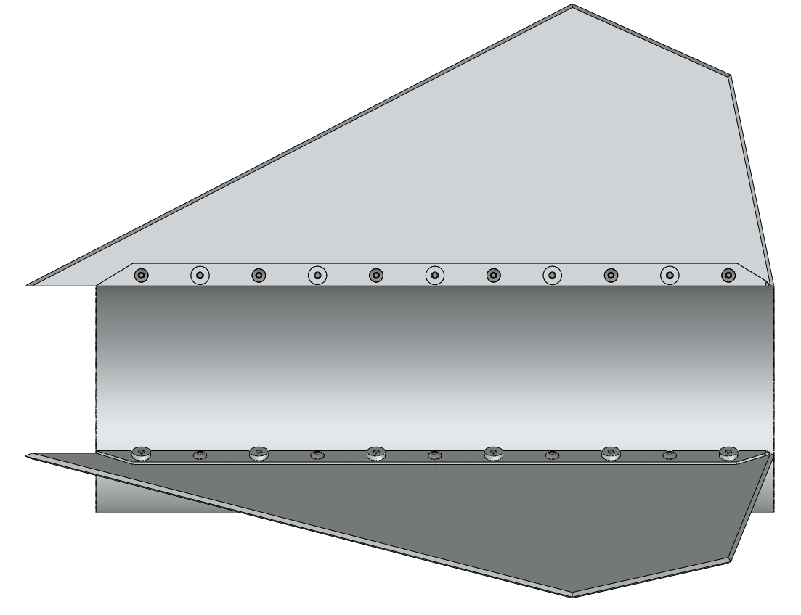
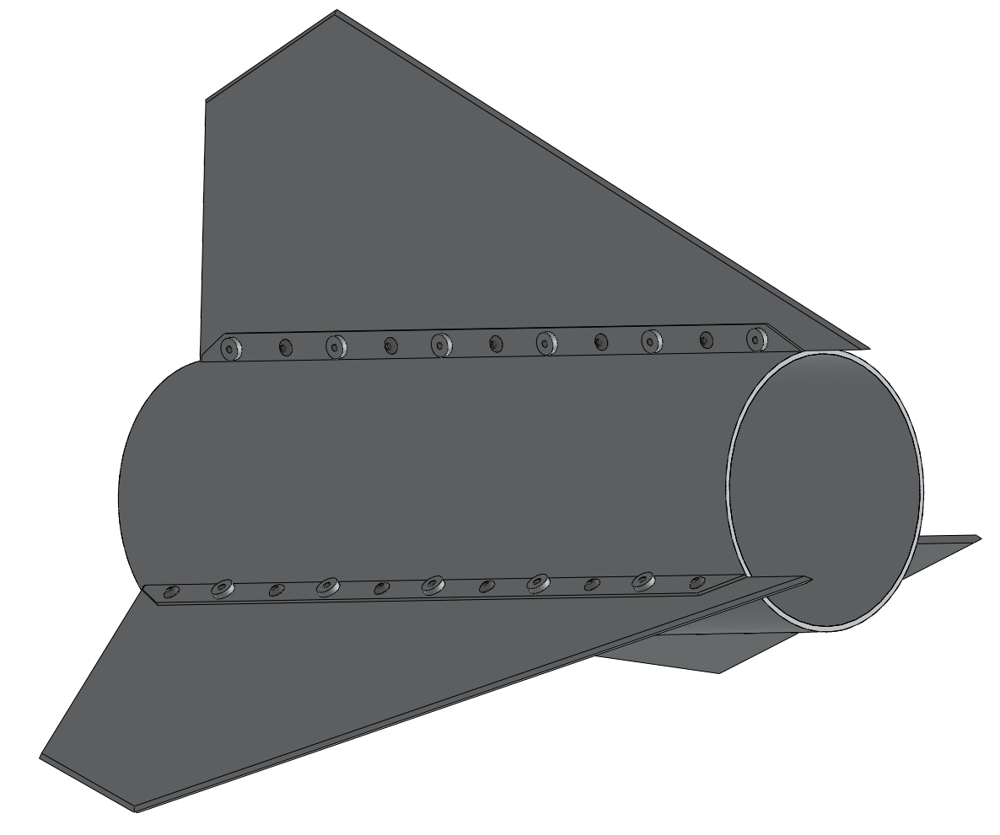

# Marcos Esparza – Engineering Portfolio  
Mechanical Engineering • Energy & Thermo-Fluids • High-Power Rocketry

[About](#about-me) • [Resume](#resume) • [Featured Project](#featured-project--irec-2026-fast-10k-cots-rocket) • [Projects](#projects) • [Skills](#skills) • [Contact](#contact)

---

## About Me

I’m a Mechanical Engineering student at the University of Texas Permian Basin focused on energy, thermo-fluids, and experimental testing. I’m part of the Falcon Aeronautics & Space Team (FAST), where I lead aerodynamic design and fin-can development for our 10,000-ft COTS rocket competing at the Intercollegiate Rocket Engineering Competition (IREC).

On the rocket side, I work on fin geometry, flutter and stability analysis, and airframe modeling using SOLIDWORKS, MATLAB, and OpenRocket. That’s given me a lot of experience thinking about loads, safety margins, manufacturability, and how hardware is actually built and assembled.

In the lab, I’ve run experiments on cross-flow heat exchangers, fluid friction and bend losses, flow-measurement devices, transient cooling, and velocity profiles. These projects gave me hands-on experience with piping, pressure drop, heat transfer, and DAQ/LabVIEW-style measurement systems, the same fundamentals used in real energy and pipeline systems.

---

## Resume

- **[📄 View Resume (PDF)](assets/img/MarcosEsparza_Resume.pdf)**
- **[🔗 View IREC GitHub Repo](https://github.com/MarcosEsparza/Falcon-Aeronautics-and-Space-Team)**

---

## Featured Project — IREC 2026 

**Role:** Aerodynamic Design Lead  
**Team:** Falcon Aeronautics & Space Team (FAST), UTPB  
**Tools:** SOLIDWORKS, MATLAB, OpenRocket, Excel  

### Overview

- Leading aerodynamic design and fin-can development for FAST’s 10,000-ft COTS rocket for IREC.  
- Designing a modular fin-can and airframe to safely reach ~10,000 ft on an L-class motor while maintaining ≥1.5× flutter margin and competition-typical stability ranges, with a focus on fin geometry, flutter and stability analysis, and recovery/avionics integration.  
- Treating the project like a small field system: tracking loads, margins, and interfaces in CAD and documentation so the hardware is safe, repeatable, and easier for the team to build and integrate.

### Technical Scope

- Designed fins and performed flutter and static-stability analysis in MATLAB and OpenRocket.  
- Modeled a 4.02-in modular airframe and aluminum fin-can in SOLIDWORKS, including internal structure.  
- Verified ≥ 1.5× V_max flutter margin and maintained stability margin within competition-typical ranges.  
- Integrated internal structure, recovery, and avionics into a single CAD model to align mass properties and interfaces.  
- Set up a documentation workflow for the IREC 2026 technical report and team GitHub repository.  
- **MATLAB Code:** [Fin Flutter Solver](https://github.com/MarcosEsparza/Falcon-Aeronautics-and-Space-Team/blob/main/simulations/matlab/fin_flutter/AluminumFinCan.m)  

### Flight Simulation — L1500T

- Apogee: **10,990 ft**  
- Max velocity: **1,191 ft/s (Mach 1.077)**  
- Max acceleration: **431 ft/s²**  
- Stability margin: **2.76 cal**  
- Simulation tool: OpenRocket (custom MATLAB post-processing)

### Aluminum Fin Can – SOLIDWORKS

- **Material:** CNC/lathe-machined 6061-T6 aluminum fin can, bolted to a 4" fiberglass airframe  
- **Design target:** ≥1.5× V_max flutter margin

**Views:** Planform • Side • Isometric  

Planform view:  

Side view:  

Isometric view:  

---

## Falcon Aeronautics & Space Team

- FAST engages students at UTPB in aerospace and space-exploration projects through hands-on design, testing, and competition work.  
- The team focuses on building practical experience in rocketry, avionics, and aerospace systems while growing aerospace opportunities in the Permian Basin.  
- **FAST Instagram:** [fast.utpb](https://www.instagram.com/fast.utpb/)  

---

## Projects

### Level 1 High-Power Certification

**Role:** Designer & Builder  
**Tools:** OpenRocket, hand calculations, shop tools  
**Launch Site:** San Angelo, TX

- Designed, built, and flew an L1 certification rocket.  
- Achieved altitude: **2,148 ft** (≈2.4% error vs prediction), validating simulation and modeling methods.  
- Motor: **H219T-14**  

<video width="480" controls>
  <source src="/engineering-portfolio/assets/img/IMG_4424.mp4" type="video/mp4">
  Your browser does not support the video tag.
</video>

---

### Level 2 Certification — In Progress

**Role:** Designer & Builder  
**Tools:** OpenRocket, CAD, testing hardware  

- Designing a 4" dual-deploy Level 2 rocket with avionics bay and separate drogue/main recovery.  
- Expected altitude: **~4,200 ft** on a **J425R-14** motor.  
- Target stability margin: **~1.9 cal**.  
- Focus on safe airframe design, recovery integration, and repeatable preparation procedures.

---

### Featured Lab Reports
A selection of lab work most relevant to thermo-fluids, energy systems, and experimental testing.

#### Pelton Turbine – Performance & Efficiency
**Role:** Lab Team Member  
**Tools:** Pelton turbine rig, load cell, tachometer, Excel  

- Characterized Pelton turbine performance under varying loads and spear-valve positions.  
- Generated torque–speed curves, calculated hydraulic power, and evaluated overall turbine efficiency.  
- Connected experimental results to turbomachinery performance and energy-system applications.  
**Report:** [PDF](/engineering-portfolio/assets/img/Lab2%20Pelton%20Turbine.pdf)

  

---

#### Cross-Flow Heat Exchanger – TE93
**Role:** Lab Team Member  
**Tools:** TE93 cross-flow rig, pitot-static tube, DAQ, Excel  

- Measured velocity, pressure drop, and dynamic pressure across a cross-flow rod bank.  
- Used correlations to evaluate heat-transfer behavior and compared experimental vs. theoretical trends.  
- Demonstrated understanding of convective heat transfer, pressure loss, and airflow behavior.  
**Report:** [PDF](/engineering-portfolio/assets/img/Lab6%20Cross%20Flow%20Heat%20Exchanger%20(1).pdf)

---

#### Fluid Friction & Bend Loss – H408
**Role:** Lab Team Member  
**Tools:** H408 apparatus, pressure gauges, Excel  

- Analyzed friction factors for smooth/rough pipes and multiple fittings.  
- Calculated Reynolds number, head loss, and minor loss coefficients (*k*, *kₗ*) and compared them to Moody/Blasius correlations.  
- Related findings to real piping networks, pump sizing, and industrial fluid systems.  
**Report:** [PDF](/engineering-portfolio/assets/img/Lab3%20Friction%20Fluid.pdf)

---

### Carbon Fiber in Aerospace — Materials Presentation

**Role:** Presenter  
**Tools:** PowerPoint, Excel  

- Compared carbon fiber and aluminum for aerospace structures, focusing on stiffness-to-weight ratio and weight reduction.  
- Discussed trade-offs in cost, manufacturability, and application to aerospace components.  
- **Presentation:** [PDF](/engineering-portfolio/assets/img/Material%20Science%20Project.pdf)  

---

### Other Lab Reports

- **Flow Measuring Devices**  
  Compared orifice plates, Venturi meters, and rotameters; evaluated discharge coefficients and measurement uncertainties.  
  **Report:** [PDF](/engineering-portfolio/assets/img/Lab5%20Flow%20Measuring%20Devices.pdf)

- **Cooling Rate / Transient Convection**  
  Used the TE93 cross-flow heat exchanger to measure transient cooling of a heated copper rod and estimate convective heat-transfer coefficients.  
  **Report:** [PDF](/engineering-portfolio/assets/img/Lab7%20Cooling%20Rate.pdf)

- **Velocity Profile in Cross-Flow**  
  Mapped velocity profile downstream of a rod bank using a pitot tube, showing wake behavior and recirculation regions.  
  **Report:** [PDF](/engineering-portfolio/assets/img/Lab8-Velocity%20Profile.pdf)

- **Impact of a Jet**  
  Investigated momentum transfer and force from a water jet striking targets; compared measured forces to theoretical predictions.  
  **Report:** [PDF](/engineering-portfolio/assets/img/Lab1%20Impact%20of%20a%20Jet-1.pdf)

- **Impact: Charpy & Izod**  
  Performed impact testing on multiple 3D-printed polymers to compare absorbed energy and fracture behavior.  
  **Report:** [PDF](/engineering-portfolio/assets/img/Lab9-Impact-Charpy%20and%20Izod.pdf)

- **Torsion Test**  
  Obtained shear modulus and torque–angle behavior of circular shafts; compared elastic and plastic response to theoretical values.  
  **Report:** [PDF](/engineering-portfolio/assets/img/lab10-%20Torsion%20Lab%20Report.pdf)

---

## Skills

**Software**

- SOLIDWORKS 
- MATLAB  
- OpenRocket  
- LabVIEW / DAQ systems  
- Excel (engineering/data analysis)  

**Engineering & Domain**

- Thermo-Fluids & Energy Systems  
- Heat Transfer (cross-flow, transient)  
- Piping, Pressure Losses & Head Loss  
- Mechanical / Structural Design & CAD  
- Experimental Methods, DAQ & Data Analysis  
- High-Power Rocketry, Aerodynamic Design & Stability  
- Recovery Systems (dual-deploy, parachute sizing & rigging)

**Certifications**

- Tripoli/NAR Level 1 (Level 2 in progress)  

---

## Organizations

- ASME — Student Member  
- NAR — Student Member  
- TRA — Student Member  
- AIAA — Student Member  

---

## Contact

- **Email:** esparza_m58311@utpb.edu  
- **LinkedIn:** [linkedin.com/in/marcos-v-esparza](https://www.linkedin.com/in/marcos-v-esparza/)

[Back to Top](#marcos-esparza--engineering-portfolio)
